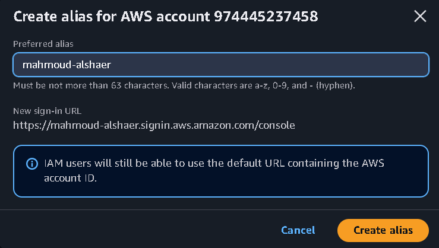
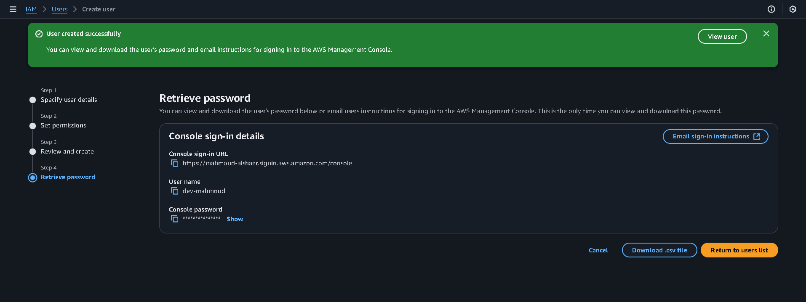
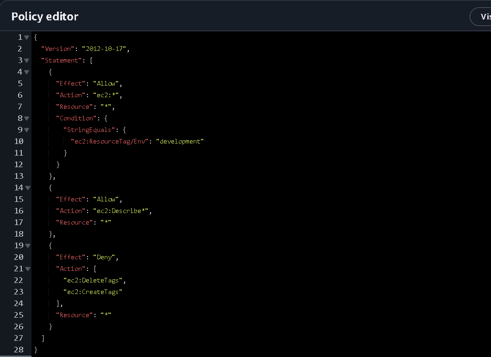
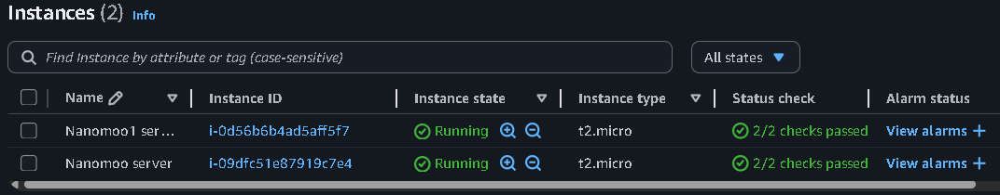
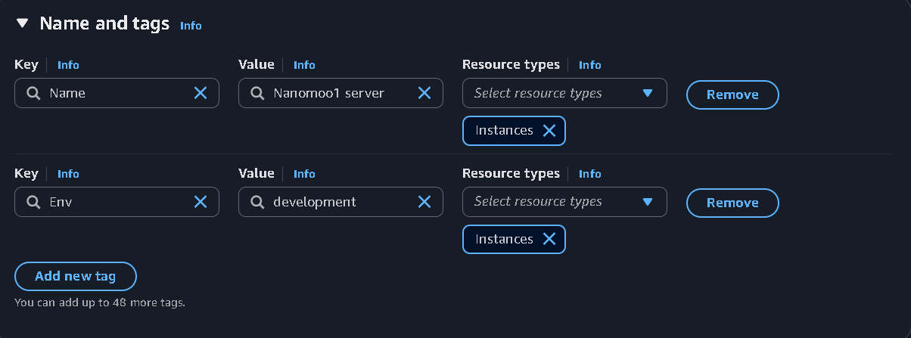
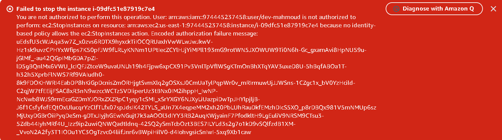
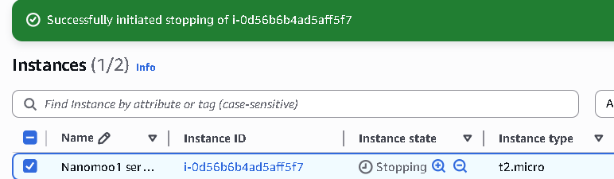

# AWS Cloud Security with IAM and EC2

## Overview
Implemented a secure AWS environment using 
Identity and Access Management (IAM) and EC2. 
Created IAM users with restricted permissions, 
configured custom JSON policies, and verified 
that security restrictions worked correctly 
across development and production environments.

## What I Built
- Custom IAM account alias (mahmoud-alshaer)
- IAM user (dev-mahmoud) with restricted access
- Custom JSON policy limiting EC2 actions
- 2 EC2 instances tagged by environment
- Verified access control worked correctly

## Steps

### 1. Created IAM Account Alias
Set up a custom sign-in URL for the AWS account 
for cleaner access management.

### 2. Created IAM User
Created a new IAM user (dev-mahmoud) with 
console access, simulating a developer account 
with restricted permissions.

### 3. Configured JSON Security Policy
Wrote a custom IAM policy that:
- Allows all EC2 actions on development 
environment only
- Allows EC2 Describe on all resources
- Denies CreateTags and DeleteTags globally

### 4. Launched EC2 Instances
Created 2 EC2 instances tagged with environment 
labels to simulate dev and production separation.

### 5. Verified Security — Access Denied ✅
Confirmed the policy worked by attempting to 
stop the production instance as the dev-mahmoud 
user — correctly received Access Denied error.

### 6. Verified Security — Access Granted ✅
Confirmed the dev-mahmoud user could 
successfully stop the development instance 
as expected.

## Security Policy Summary
| Action | Dev Environment | Prod Environment |
|---|---|---|
| EC2 Start/Stop | ✅ Allowed | ❌ Denied |
| EC2 Describe | ✅ Allowed | ✅ Allowed |
| CreateTags | ❌ Denied | ❌ Denied |
| DeleteTags | ❌ Denied | ❌ Denied |

## Key Concepts Demonstrated
- IAM user creation and management
- Custom JSON policy writing
- EC2 instance tagging by environment
- Principle of least privilege
- Access control verification and testing

## Services Used
- AWS IAM
- Amazon EC2
- AWS Policy Editor
