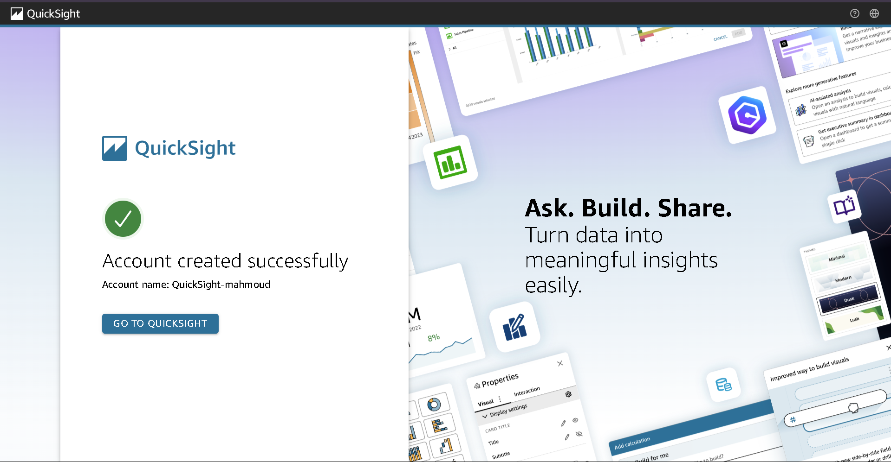
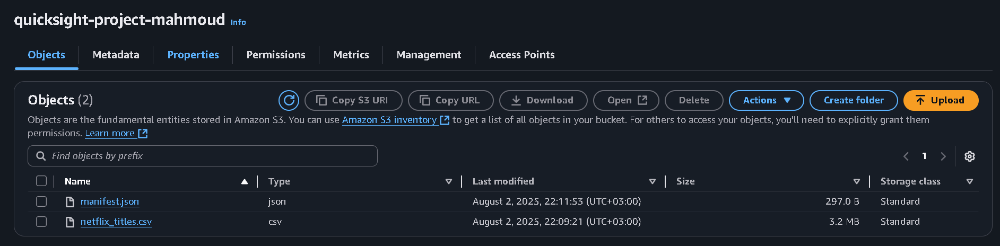
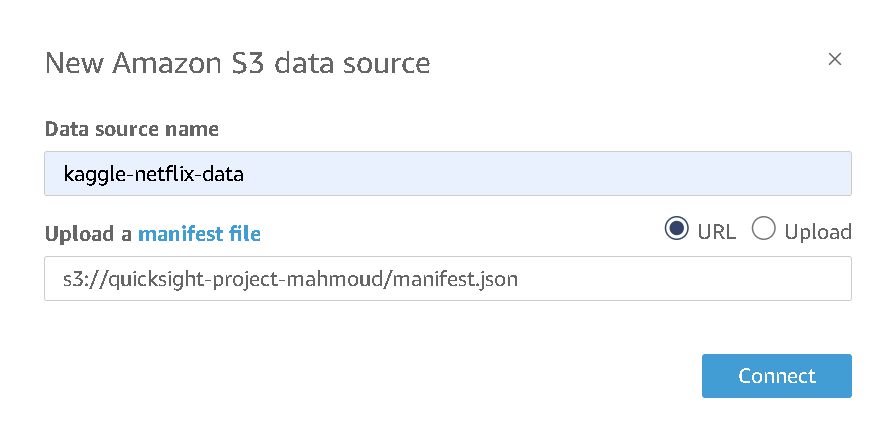
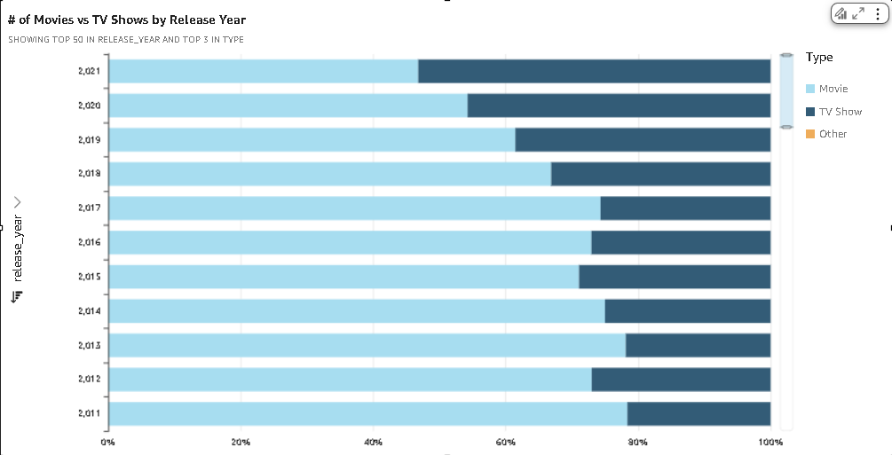
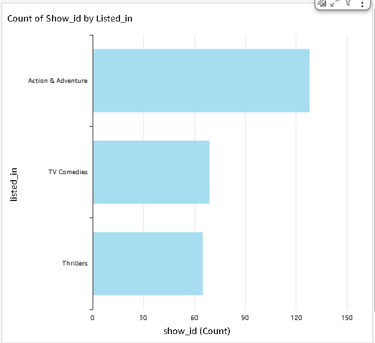
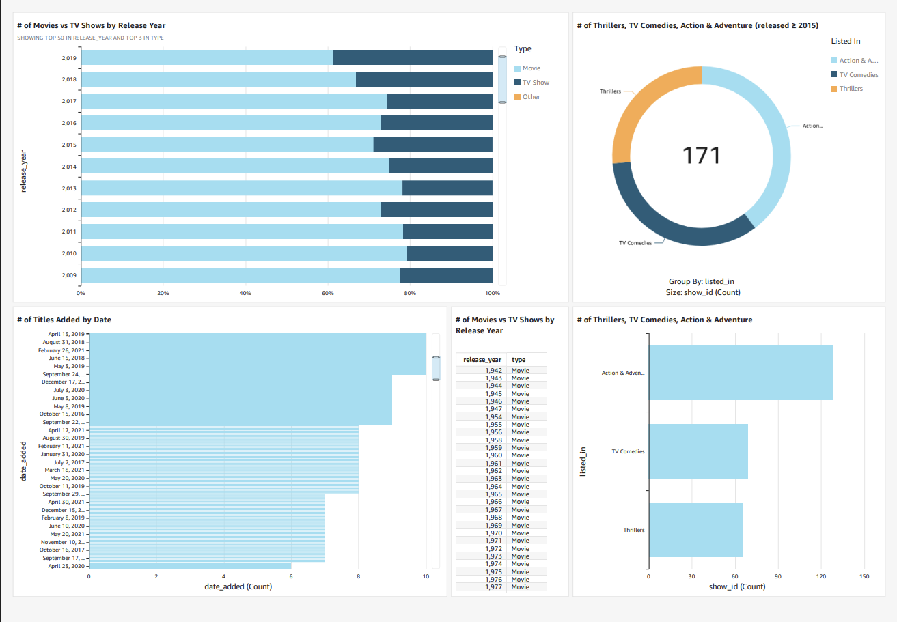

# AWS Data Visualization with Amazon QuickSight

## Overview
Analyzed and visualized Netflix titles dataset 
using Amazon QuickSight. Connected S3 as a data 
source, built interactive charts and a complete 
dashboard showing content trends across genres, 
release years, and content types.

## Dataset
- **Source:** Kaggle Netflix Titles Dataset
- **Size:** 3.2 MB (netflix_titles.csv)
- **Storage:** Amazon S3 bucket 
(quicksight-project-mahmoud)

## What I Built

### 1. QuickSight Account Setup
Created an Amazon QuickSight account and 
configured it to connect to AWS services.

### 2. S3 Data Source Configuration
Uploaded netflix_titles.csv and manifest.json 
to S3, then connected QuickSight to the bucket 
as a data source.

### 3. Built Interactive Charts
Created multiple visualizations including:
- Movies vs TV Shows by Release Year (bar chart)
- Genre distribution with filters

### 4. Completed Dashboard
Built a full analytics dashboard combining 
multiple charts showing Netflix content trends 
from 2009 to 2021.

## Key Insights from the Dashboard
- Movies consistently outnumber TV Shows 
across all release years
- Action & Adventure is the most common genre
with 130+ titles
- Content additions peaked around 2019-2021

## Key Concepts Demonstrated
- Amazon QuickSight account setup
- S3 as a data source with manifest.json
- Interactive dashboard creation
- Data filtering and visualization
- Real-world dataset analysis

## Services Used
- Amazon QuickSight
- Amazon S3
- Kaggle Netflix Dataset
