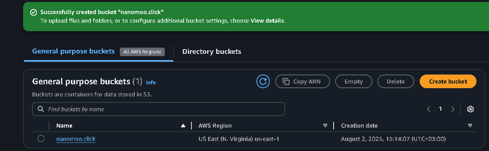
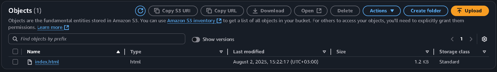
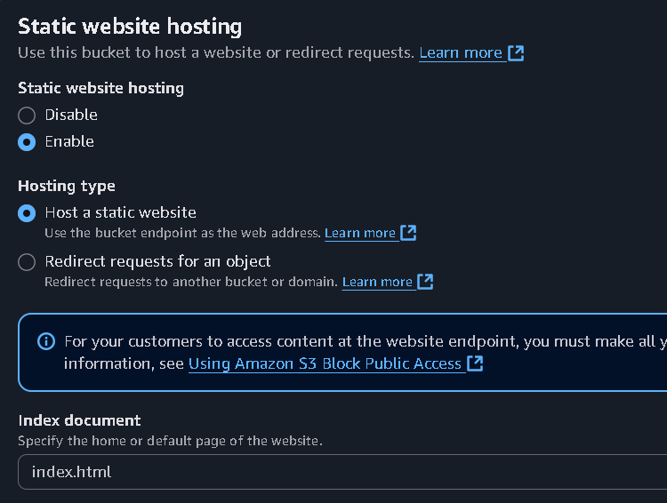
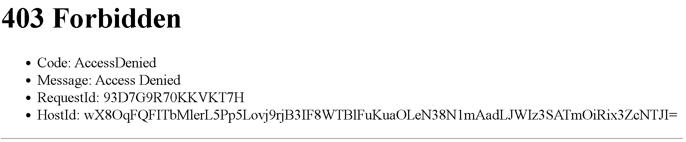
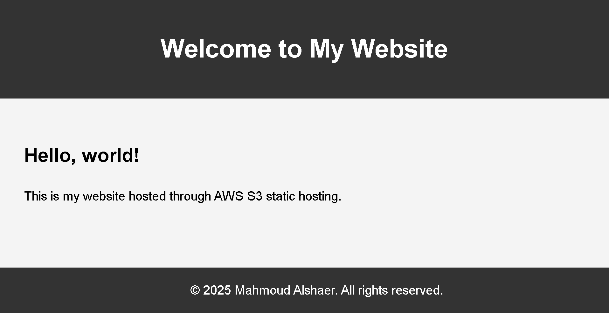

# AWS S3 Static Website Hosting

## Overview
Deployed a static website using Amazon S3 static 
website hosting. Configured bucket permissions, 
uploaded web files, and resolved access control 
issues to make the site publicly accessible.

## What I Built
- S3 bucket created in us-east-1 (N. Virginia)
- Static website hosting enabled with index.html
- Uploaded HTML files to the bucket
- Configured public access settings
- Resolved 403 Forbidden access error

## Steps

### 1. Created S3 Bucket
Created a new S3 bucket named "nanomoo.click" 
in the US East region.

### 2. Uploaded Website Files
Uploaded index.html to the bucket as the 
main entry point for the website.

### 3. Enabled Static Website Hosting
Configured the bucket to host a static website 
with index.html as the index document.

### 4. Troubleshot 403 Forbidden Error
Encountered and resolved a 403 Access Denied 
error by configuring the correct bucket policy 
to allow public read access.

### 5. Website Live
Successfully deployed the website and confirmed 
it was publicly accessible.

## Key Concepts Demonstrated
- S3 bucket creation and configuration
- Static website hosting setup
- Bucket policy and public access settings
- Troubleshooting AWS permission errors

## Services Used
- Amazon S3
- S3 Static Website Hosting
